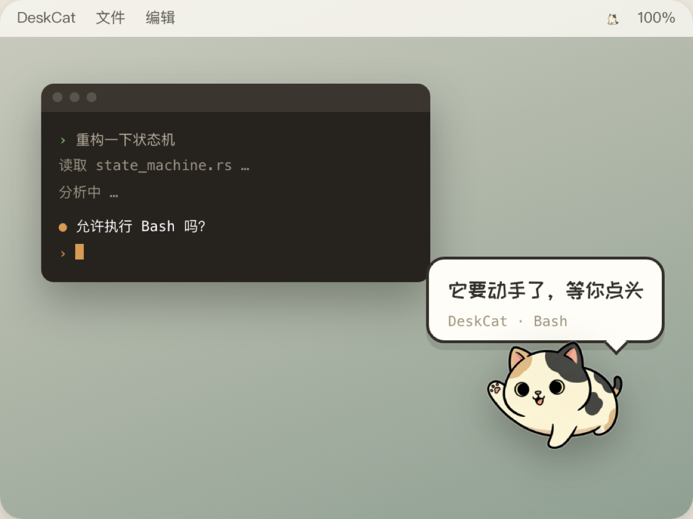

<div align="center">

# DeskCat

**你的 AI 在跑的时候，它替你盯着。**

一只趴在 macOS 桌面角落的小猫，能感知你的 Claude Code 在干什么。
它停下来等你批权限时，猫会招手叫你——这是它最有用的一刻。

[下载](#下载) · [它会演什么](#它会演什么) · [这只猫哪来的](#这只猫哪来的) · [隐私](#隐私)



</div>

---

## 它解决什么问题

把任务交给 Claude Code 之后，你切去干别的事。这段时间里你要么反复切回终端看进度，要么**忘了它早就停在权限确认上干等**。

DeskCat 把这段等待变成余光可见：不用切窗口就知道 AI 的状态，它需要你时会叫你。

## 它会演什么

| 状态 | 什么时候 | 表现 |
|---|---|---|
| **busy** | 读文件、跑命令、写代码 | 趴着敲小键盘 |
| **waiting** | **停在权限确认或等你回话** | 探头招手 + 常驻气泡（标明哪个项目、哪个工具）+ 一声可关的提示音 |
| **celebrating** | 一轮任务完成 | 庆祝几秒后回待机 |
| **alert** | 出错了 | 炸毛，气泡常驻到你处理 |
| **greeting** | 会话开始 / 睡醒 | 打招呼、伸懒腰 |
| **idle** | 没事干 / 你走开了 | 待机、打盹 |

还有摸头反应——点它一下会有小动作。没有养成、没有数值、不聊天，纯陪着。

## 这只猫哪来的

**它来自一张图。**

市面上的桌宠每加一个形象都是美术几天的手工活。DeskCat 的形象是喂一张参考图，由 AI 生成全部九个状态：

```
一张参考图
  → 9 个基帧（每个状态一张立绘）
  → 14 个微变帧（"只闭眼，其余完全一致"）
  → flood fill 抠透明
  → 拼成动态 WebP + pack.json
```

一整套 23 次推理，几分钟出。内置的三花猫和水豚都是这条管线产出的。

自己动手：

```bash
node scripts/build-pack.mjs --ref <你的图.png> --id mycat --name 我的猫
node scripts/build-pack.mjs --id mycat --redo waiting   # 单个状态重新生成
```

需要 [fal.ai](https://fal.ai) 的 API key，写进仓库根目录的 `.env.local`：

```
FAL_KEY=你的key
```

> 应用本体**不包含**这套管线，也不需要任何 key —— 它是纯本地、零联网的。

## 隐私

- **零联网。** 除了监听本机回环 `127.0.0.1:43917` 接收 Claude Code 的回调，没有任何对外网络连接。
- **不记录按键。** 感知你在不在电脑前，只读系统的「距上次输入过了几秒」这一个数字，**物理上拿不到你敲了什么**。全程不需要辅助功能授权。
- **无账号、无遥测、无崩溃上报。** 配置只存在你自己机器上。

## 它有多安静

桌宠是要挂一整天的东西。以下是 release 版实测：

| 指标 | 实测 |
|---|---|
| 空闲 CPU | **0.0%**（6 分钟 12 次采样） |
| 常驻内存 | **71.7 MB**（进入平台期后不再增长） |
| 安装包 | **7.1 MB**（原生 arm64 / x86_64） |
| 对外网络连接 | **0** |

架构上全事件驱动：没有轮询文件监听，只有一个秒级兜底定时器和一个 5 秒的空闲采样。

## 下载

到 [Releases](../../releases) 下载对应你芯片的版本：

| 芯片 | 文件 |
|---|---|
| Apple Silicon（M 系列） | `DeskCat-x.y.z-apple-silicon.dmg` |
| Intel | `DeskCat-x.y.z-intel.dmg` |

> 不确定选哪个？点左上角  → 关于本机，看「芯片」那一行。

已经过 Apple 签名与公证，双击即可使用，不需要绕安全提示。

## 怎么连 Claude Code

装好后**双击小猫**打开设置窗口 → 「Claude Code」页 → 点「一键连接」。

它会往 `~/.claude/settings.json` 追加 7 条 hook（每个事件一条 `curl` 到本机端口）：

- **只追加，不覆盖**你已有的任何配置
- **写入前自动备份**原文件
- 随时可以在同一个位置**一键断开**，还原到安装前的状态
- hook 命令带 `-m 1` 超时和 `|| true`，DeskCat 没开着也不会拖慢或阻断 Claude Code

## 本地开发

需要 Rust、Node 18+、Xcode Command Line Tools。

```bash
npm install
npm run tauri dev          # 开发模式
cd src-tauri && cargo test # 单元测试（75 条）
```

发版（需要 Apple Developer 证书）：

```bash
./scripts/release.sh       # 分架构出包 + 签名 + 公证，产物在 安装包/
```

调试开关：

```bash
DESKCAT_DEBUG=1      # 状态机流转、前端日志
DESKCAT_HIT_DEBUG=1  # 点击穿透的命中判定
```

## 项目结构

```
src/                前端（跑在 WebView 里）
  pet/              桌面上那只猫的窗口
  settings/         设置窗口
  components/       共用组件库 + 字体
  packs/            形象包（动态 WebP + pack.json）

src-tauri/          Rust 后端（原生外壳）
  src/
    state_machine.rs    六态状态机 + 仲裁 + 兜底回落
    sources/            事件源：Claude hooks / 键鼠感知
    hit_through.rs      全局鼠标监听 + alpha 掩码（点击穿透）
    drag.rs             跨屏拖拽
    hooks_install.rs    安全改写 ~/.claude/settings.json
    fullscreen.rs       全屏检测
    tray.rs             菜单栏

scripts/            形象生成管线、抠图、发版
site/               官网
```

架构上三条硬规则：**事件源和渲染层都不碰状态机，只通过事件总线通信**；**状态机用语义命名**（不绑死"Claude 正在思考"）；**换形象包零代码改动**。

## 系统要求

macOS 12 及以上。目前仅 macOS。

## 许可

[GNU GPLv3](LICENSE)。

你可以自由使用、修改、商用，但**分发衍生版本时必须同样以 GPLv3 开源**。
这是为了避免有人拿它做成闭源产品。
